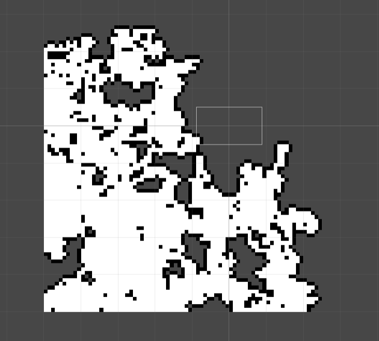
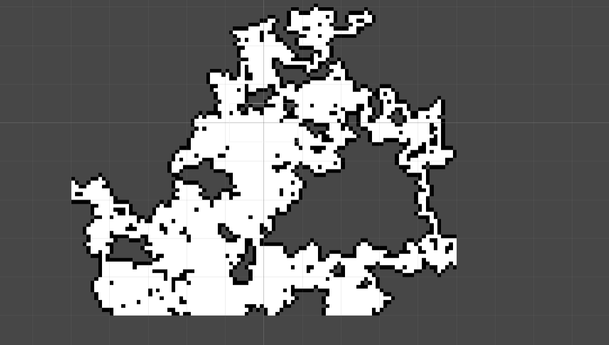
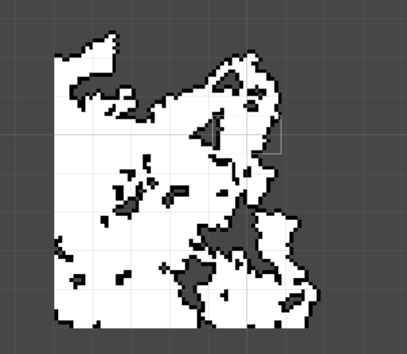
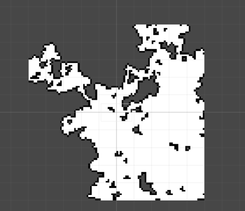
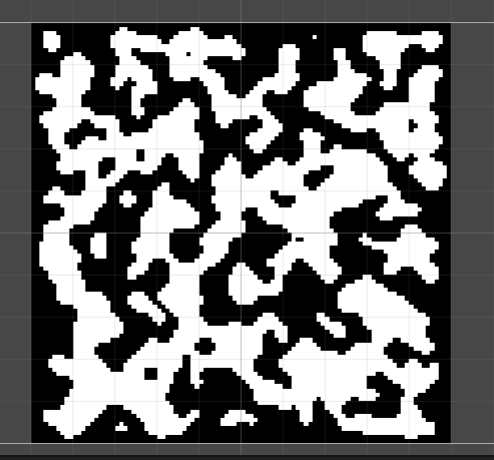
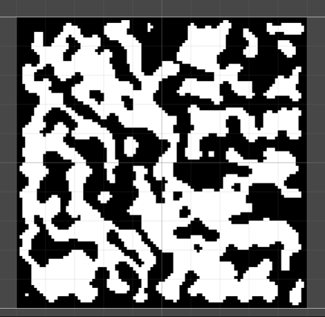
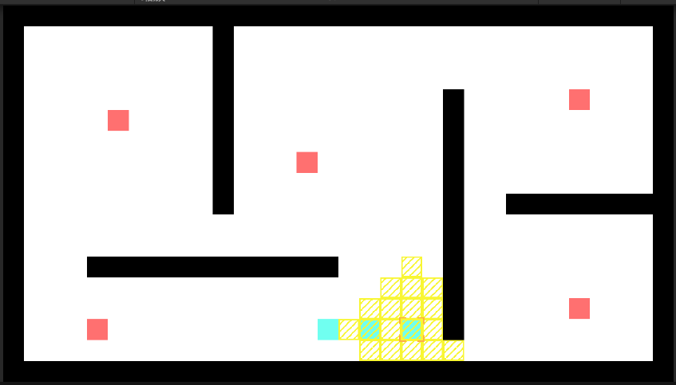
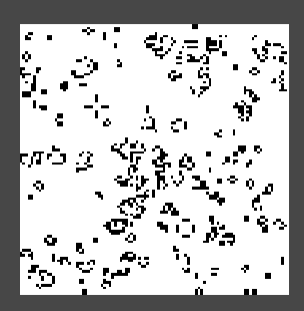
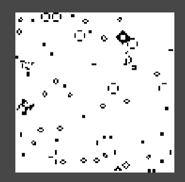

# SSRPG

## main

战棋游戏实现中

>程序设计

### 随机地图

> 随机游走算法

> 算法优化

> 细胞洞穴

### 地图编辑

## GameOfLife

该分支实现了[生命游戏](https://zh.wikipedia.org/wiki/%E5%BA%B7%E5%A8%81%E7%94%9F%E5%91%BD%E6%B8%B8%E6%88%8F)

