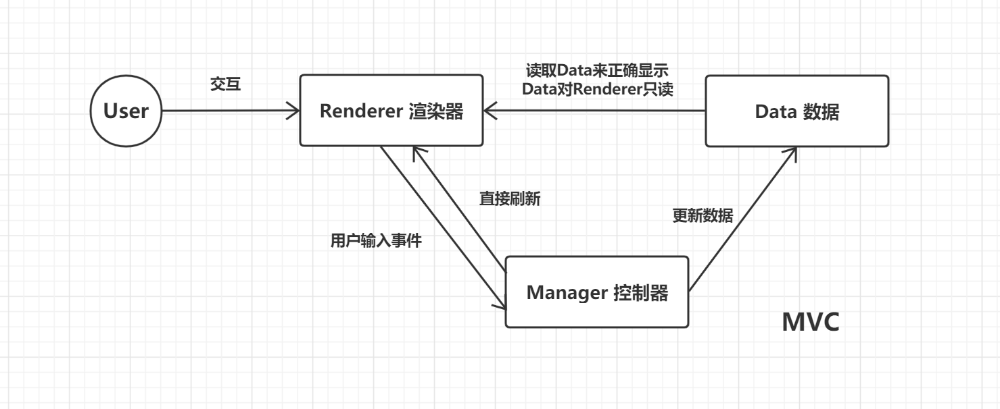
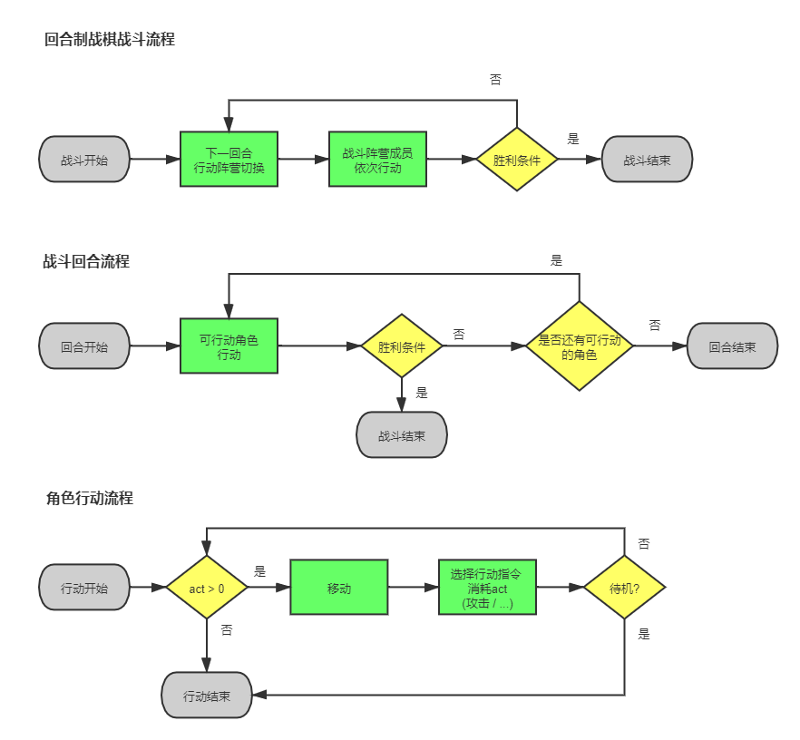

# 程序设计思路

## 游戏玩法

战棋

## 游戏模块

- 战棋战斗系统
- 角色培养系统
- 武器装备系统

## 战棋战斗系统

战斗模式：回合制



```cpp
数据

战场地图 = {宽度，高度，四边形瓦片单元格，出生点位置}
    瓦片单元格 = {位置，类型}
        位置 = {行，列}
        类型 = {平地，障碍}

战斗单位 = {位置，阵营，属性}
    位置 = {行，列}
    阵营 = {敌方，我方，中立}
    属性 = {血量，血量上限，攻击力}
```

```cpp
逻辑管理器

战斗管理器 = {战场地图，战斗单位，战斗逻辑，战斗初始化逻辑，战斗结算逻辑}
    战斗逻辑 = {回合控制逻辑，战斗单位行动逻辑，行动顺序逻辑，伤害计算逻辑，胜利失败逻辑}
```

```cpp
渲染器

战斗渲染器 = {战场渲染器，战斗单位渲染器，交互逻辑 }

战场渲染器 = {战场地图，渲染逻辑}

战斗单位渲染器 = {战斗单位，渲染逻辑}
```



## 代码重构
```lua
1. BattleUnit上封装一层BattleTeam。--完成
2. 建立BattleEventMgr类。
3. 把Renderer里面的一些战斗相关逻辑移入Manager，Renderer只负责传递一级输入事件。--完成
4. BattleUnit渲染方式由Tilemap改为Sprite。 --完成
5. 整理代码
6. 引入战斗回合概念
7. 编写战斗单位AI
8. 实现战斗单位攻击/受击/死亡功能和相关UI
```